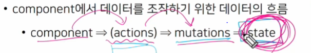
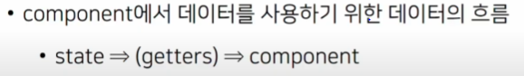
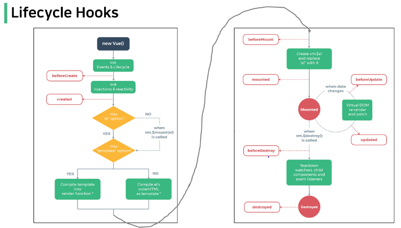

## VUEX

### 상태 관리

State Management

상태(State)란?

 현재에 대한 정보(Data)

현재 App이 가지고 있는 Data로 표현

여러개의 component를 조합해 App을 만들고 있기에 여러개의 component가 같은 상태를 유지하게 할 필요가있음

Pass prop & Emit Event

prop과 event로 상태관리해 같은 데이터를 공유 하고 있으므로

component의 중첩이 깊어지면 데이터 전달이 쉽지 않다

공통 상태를 유지해야 하는 component가 많아지면 데이터 전달 구조가 복잡해짐

 Centrailized Store

중앙 저장소에 데이터를 모아서 상태 관리

각 component는 중앙 저장소의 데이터를 사용

중앙화된 저장소에서 계층에 상관 없이 중앙 저장소에 접근해서 데이터를 얻거나 변경 가능.

프로젝트 with Vuex

Vuex의 핵심 컨셉 4가지

1. state: 중앙 저장소의 데이터 기존 vue에 쓰던 data
2. getters: 기존 vue의 computed
3. mutations:  기존 vue의 methods
4. actions: 기존 vue의 methods

### state

중앙에서 관리하는 모든 상태 정보

개별 component가 관리하던 데이터를 중앙 저장소에서 관리하게 됨

### mutations

실제로 state를 변경하는 유일한 방법

vue 인스턴스의 methods에 해당하지만 핸들러 함수는 반드시 동기적 이어야함

첫번째 인자로 state 받음

### actions

mutations와 비슷하지만 비동기 작업을 포함할수 있다.

state를 직접 변경하지 않고 commit() 메서드로 mutations 호출해서 state를 변경함

컴포넌트에서 dispatched() 메서드에 의해 호출됨

### Mutations & Actions

Mutations: State를 변경

Actions: State 변경을 제외한 나머지 로직

### getters

기존 vue의 computed에 해당

state를 활용하여 계산된 값을 얻고자 할 때 사용

Vuex에서도 여전히 pass props와 emit event를 사용하여 상태 관리할 수있음

객체 메서드 축약형을 사용할것

키 벨류 형태에서 () { 형태로 바뀜

## Lifecycle Hooks

